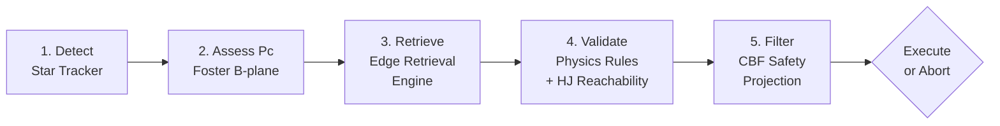

# AEGIS-MESH 🛰️🛡️

### Autonomous Edge Guidance & ISL Swarm Mesh for Decentralized Space Domain Awareness & Collision Avoidance

**NASA Space Apps Challenge 2026** · [Challenge: _[TODO: Insert specific 2026 challenge name and link]_]

[](https://www.spaceappschallenge.org/)
[](https://fastapi.tiangolo.com/)
[](https://react.dev/)
[](https://threejs.org/)
[](LICENSE)

> **One-sentence pitch:** AEGIS-MESH pushes collision assessment and evasion planning from ground stations to the satellite's own edge processor, cutting the decision loop from hours to sub-second—demonstrated with a verified Foster Pc engine, a physics rule pipeline, and a live 3D visualization.

🚀 **[Are you a judge looking for the hardcore math and architecture? Read the Super Detailed README (Nerd's Guide) here!](README_DETAILED.md)**

<!-- TODO: Replace with a demo GIF or 30-second video link -->
<!--  -->

---

## Team

| Member | Role |
|--------|------|
| _[TODO: Add team members]_ | _[TODO: Add roles]_ |

> **AI Disclosure:** This project used AI coding assistants (GitHub Copilot, Antigravity) for code generation and documentation. All scientific formulations were human-designed and human-verified.

> **[Space Apps Team Page](https://www.spaceappschallenge.org/)** ← _TODO: Link to your actual team page_

---

## Why This Matters

Space debris is the #1 long-term threat to sustainable LEO operations. Ground-based tracking can't see objects below ~10 cm, and the screening-to-maneuver pipeline takes 8–24 hours. For fast-closing micro-debris, that latency is fatal. AEGIS-MESH explores what happens when you move the detect-assess-evade loop onboard the satellite itself.

---

## What's Real vs. Simulated

> [!IMPORTANT]
> We distinguish clearly between implemented/verified components and conceptual demonstrations.

| Component | Status | Notes |
| ----------- | -------- | ------- |
| **Foster Pc (CARA method)** | ✅ Implemented & verified | Gauss–Legendre quadrature, checked vs. Rician closed-form and 400k Monte Carlo |
| **SGP4 propagation** | ✅ Implemented & verified | Checked against Vallado reference cases (AIAA 2006-6753) |
| **CDM parsing & validation** | ✅ Implemented | CCSDS 508.0-B-1 / ISO 19389 structural validator |
| **Physics rule pipeline** | ✅ Implemented | Propellant budget (Tsiolkovsky), burn time, perigee floor — with fault injection |
| **2-state HJ reachability** | ✅ Implemented (simplified) | 2-state double integrator with 3 control values. NOT the 4-state HCW model. |
| **CBF safety filter** | ✅ Implemented (simplified) | Closed-form projection, not a general QP. Thrust clipping breaks formal guarantee. |
| **Edge Retrieval Engine** | ⚠️ Prototype (untrained) | Seeded-random 256×16 codebook. Architecture demo only — not trained via InfoNCE. |
| **3D globe with real debris** | ✅ Implemented | 6,000+ real Celestrak TLE objects, SGP4-propagated |
| **GPU hardware profiler** | 🔶 Simulated UI | All metrics (latency, power, temp) are `Math.random()` — for demonstration only |
| **Optical debris detection** | 🔶 Concept only | Star tracker detection of cm-class debris is an unresolved feasibility challenge |
| **Wasm workload migration** | 🔶 Concept UI | Animated simulation, no real Wasm state transfer |
| **QKD inter-satellite links** | 🔶 Concept UI | Hardcoded values, no real quantum key exchange |

---

## Honest Limitations

1. **Detection range:** Detecting 0.5–1 cm debris with a star tracker at 100–600 km is likely beyond current sensor capability (limiting magnitude ~6–7). A realistic system would target 5–10 cm objects at shorter range, or use cooperative mesh triangulation.
2. **Angles-only orbit determination:** A single camera provides no range. Computing Pc and covariance from one observer in seconds is an open research problem.
3. **Untrained retrieval model:** The "Edge Retrieval Engine" (formerly CLM) uses seeded random weights, not a trained model. It demonstrates the retrieval architecture only.
4. **Simplified HJ model:** The reachability solver uses a 2-state double integrator, not the 4-state HCW equations described in the research docs. This is a simplification.
5. **CBF saturation:** Clipping thrust to `u_max` in the CBF filter breaks the formal forward-invariance guarantee. A proper feasibility check or slack variable is needed.
6. **Latency claims:** The "16 ms" figure covers only the dot-product codebook lookup. The full pipeline (Pc + rules + HJ + CBF) in Python is slower. We have not benchmarked it end-to-end on real edge hardware.

---

## Architecture: 5-Stage Evasion Pipeline



1. **Detect:** Onboard star tracker flags anomalous streaks against the sidereal background
2. **Assess:** Foster (1992) 2D B-plane Pc via Gauss–Legendre polar quadrature
3. **Retrieve:** Edge retrieval engine ranks candidate Δv vectors by dot-product similarity
4. **Validate:** Physics rules (Tsiolkovsky, burn time, perigee floor) + HJ reachability check
5. **Filter:** CBF closed-form safety projection — system can ABORT if no safe maneuver exists

---

## NASA Data & Standards Used

| Source | How Used | Implementation |
| -------- | ---------- | ---------------- |
| **Celestrak / Space-Track TLEs** | Live debris catalog for 3D globe; conjunction screening | `backend/app/tle_client.py`, `backend/fetch_real_debris.py` |
| **CARA Pc Method** | Reimplementation of Foster & Estes (1992) probability of collision | `backend/app/cara_engine.py` (NOT the NASA CARA SDK — our own reimplementation) |
| **CCSDS 508.0-B-1** | CDM parsing and structural validation | `backend/app/cdm_parser.py`, `backend/app/vv/cdm_validator.py` |
| **NAIF SPICE kernels** | Solar phase angles, ephemeris computation | `backend/simulators/spice_orbit_sim.py` (uses SPK kernel files) |
| **ORDEM (inspired)** | Debris flux environment modeling | `src/lib/debrisModel.ts` — ORDEM-inspired parameters, not actual ORDEM flux tables |

> [!NOTE]
> Data from Celestrak is sourced from the 18th Space Defense Squadron catalog. We cite it as "Celestrak TLE data", not "NASA data."

---

## Quickstart

### Prerequisites

- **Node.js** v22.6+ (for `--experimental-strip-types` in test script)
- **Python** 3.10+
- **Docker** _(optional)_ for resource-constrained container testing

### 1. Clone & Install

```bash
git clone https://github.com/DSeahYS/aegis-mesh.git
cd aegis-mesh
npm install
```

### 2. Frontend

```bash
npm run dev
# Open http://localhost:5173
```

### 3. Backend

```bash
cd backend
python -m venv venv
venv\Scripts\activate        # Windows (Linux/macOS: source venv/bin/activate)
pip install -r requirements.txt
uvicorn app.main:app --host 0.0.0.0 --port 8000
```

> The frontend proxies `/api/*` to port 8000. Check `http://localhost:8000/docs` for Swagger UI.

> [!TIP]
> The frontend degrades gracefully when the backend is offline — the 3D globe and UI still work.

### 4. Run Tests

```bash
# Backend math & physics tests (offline):
cd backend && pytest tests -m "not network" -v

# Frontend data flow checks:
npm test
```

### 5. Resource-Constrained Docker (Optional)

```bash
docker compose up --build
# Runs backend with 0.5 CPU core / 256 MB RAM limits
```

---

## Verification & Validation

The V&V Proof tab in the UI runs live backend tests judges can verify:

| Test | What it Checks | Tolerance |
| ------ | ---------------- | ----------- |
| `PC-RICIAN-EXACT` | Foster Pc vs. Rician analytical oracle | < 10⁻⁶ relative |
| `PC-MONTE-CARLO` | Foster Pc vs. 400k Monte Carlo | < 4σ_MC |
| `SGP4-VALLADO-T0/T360` | SGP4 vs. Vallado reference | < 10⁻⁵ km |
| `HJ-GRID-ANALYTIC` | HJ grid vs. analytic characteristic | < 1% sign agreement |
| `CBF-INVARIANCE` | CBF filter keeps h(x) ≥ 0 in simulation | Boolean |
| `RULE-TSIOLKOVSKY` | Rejects burns exceeding propellant budget | Boolean |
| `RULE-PERIGEE` | Rejects burns dropping perigee < 200 km | Boolean |
| `CDM-VALIDATOR` | CCSDS 508.0-B-1 structural checks | Boolean |

The fault injection presets (Starved Propellant, Weak Thruster, Strong Disturbance) demonstrate the system refusing safely with `ABORT_NO_SAFE_MANEUVER`.

---

## Interactive Views

The frontend provides 9 specialized views:

1. **Mission Dashboard** — Aggregate threat matrix, maneuver log, system health
2. **3D Orbital Globe** — WebGL Earth with 6,000+ real debris objects, 12 satellites, laser ISL links
3. **Conjunction Assessment** — B-plane plot, Pc gauge, trade-space scatter (illustrative)
4. **Mesh Network** — Constellation topology, workload migration simulation, QKD concept display
5. **System Architecture** — End-to-end pipeline flowchart, hardware comparison
6. **Edge Retrieval Lab** — Interactive codebook matching playground (prototype, untrained)
7. **Hardware Profiler** — ⚠️ **Simulated** GPU/FPGA metrics for demonstration only
8. **Backend Console** — Live API testing, Celestrak TLE fetch, CDM parsing
9. **V&V Proof** — Live mathematical verification suite (for judges)

---

## Repository Structure

```text
aegis-mesh/
├── backend/
│   ├── app/
│   │   ├── main.py                  # FastAPI REST application (15+ endpoints)
│   │   ├── clm_engine.py            # Edge Retrieval Engine (prototype, seeded codebook)
│   │   ├── cara_engine.py           # Foster 2D B-plane Pc quadrature & oracles
│   │   ├── cdm_parser.py            # CCSDS 508.0-B-1 CDM parser
│   │   ├── tle_client.py            # Celestrak client + SGP4 propagation
│   │   ├── conjunction_service.py   # Conjunction screening & assessment
│   │   └── vv/                      # Verification & Validation engine
│   │       ├── pipeline.py          # 5-stage evasion pipeline
│   │       ├── selftest.py          # Mathematical test oracles
│   │       ├── cbf_filter.py        # CBF safety filter (closed-form projection)
│   │       ├── hj_reachability.py   # HJ reachability (2-state double integrator)
│   │       ├── physics_validator.py # Physics rules (R1, R2, R3)
│   │       ├── epg.py           # Symbolic physics rule graph (EPG-inspired)
│   │       └── cdm_validator.py     # CDM structural validator
│   ├── simulators/                  # Astrodynamics & hardware simulators
│   ├── tests/                       # Pytest suite
│   ├── requirements.txt
│   └── Dockerfile
├── src/                             # React 18 + Three.js frontend
│   ├── components/                  # UI components (9 views)
│   ├── lib/                         # Orbital mechanics, retrieval engine, API client
│   ├── data/                        # Constellation, debris scenarios, hardware specs
│   └── store/                       # Zustand global state
├── benchmark/                       # Latency benchmark suite
├── Research/                        # Concept docs & research paper
├── docs/                            # Extended documentation
│   ├── math.md                      # Mathematical derivations (moved from README)
│   ├── api.md                       # API reference
│   └── simulators.md               # Simulator deep-dive
├── docker-compose.yml               # Resource-constrained container
├── LICENSE                          # Apache 2.0
└── package.json
```

---

## Future Work

These items are **proposed concepts, not implemented features:**

- **Trained retrieval model:** Replace seeded codebook with InfoNCE-trained model on generated maneuver data
- **4-state HCW dynamics:** Upgrade HJ reachability from 2-state to 4-state Hill-Clohessy-Wiltshire equations
- **Real ORDEM flux tables:** Integrate actual NASA ORDEM 4.0 flux data instead of inspired parameters
- **Hardware-in-the-loop:** Profile on NVIDIA Jetson Orin Nano and Microchip PolarFire SoC
- **QKD inter-satellite links:** Explore quantum key distribution for secure mesh communication
- **Wasm workload migration:** Investigate stateful WebAssembly migration over optical ISLs
- **Radiation resilience:** Evaluate ZES100 latch-up detection circuits for COTS protection

---

## References

1. Department of Commerce / Office of Space Commerce (OSC): _TraCSS CDM Specification_, 2024. [space.commerce.gov](https://space.commerce.gov/tracss-listening-session-conjunction-data-message-cdm-specification/)
2. NASA GSFC: _Spacecraft Conjunction Assessment and Collision Avoidance Best Practices Handbook_, NASA/SP-20205001302. [nodis3.gsfc.nasa.gov](https://nodis3.gsfc.nasa.gov/OCE_docs/OCE_51.pdf)
3. Foster, J. L., & Estes, H. S.: _A Parametric Analysis of Orbital Debris Collision Probability and Maneuver Rate for Space Vehicles_, NASA/JSC-25898, 1992.
4. Hall, D. T.: _Implementation Recommendations for 2D Pc Estimates in CARA Tools_, NASA GSFC, 2019. [NASA NTRS](https://ntrs.nasa.gov/api/citations/20190028904/downloads/20190028904.pdf)
5. NASA ODPO: _Orbital Debris Engineering Model (ORDEM 3.2)_, 2023.
6. Ames, A. D. et al.: _Control Barrier Functions: Theory and Applications_, IEEE ECC, 2019. [IEEE Xplore](https://ieeexplore.ieee.org/document/8796030)
7. Mitchell, I. M. et al.: _A Time-Dependent Hamilton-Jacobi Formulation of Reachable Sets_, IEEE TAC, 50(7), 2005. [IEEE Xplore](https://ieeexplore.ieee.org/document/1453531)
8. Vallado, D. A. et al.: _Revisiting Spacetrack Report #3: Rev 2_, AIAA 2006-6753, 2006.
9. CCSDS: _Conjunction Data Message_, CCSDS 508.0-B-1 / ISO 19389, 2013.
10. Ant Group & OpenKG: _OpenSPG_, 2024. [github.com/OpenSPG/openspg](https://github.com/OpenSPG/openspg) — Our physics rule graph is inspired by the OpenSPG paradigm but implemented locally as Edge Physics Graph (EPG) without external dependencies.

---

<p align="center">
  <b>Project AEGIS-MESH</b> • <b>NASA Space Apps Challenge 2026</b><br>
  <i>Decentralizing Space Domain Awareness for a Sustainable Orbital Future.</i><br>
  <sub>React 18 + Three.js • FastAPI • Verified Foster Pc + Physics Rules + CBF + HJ</sub>
</p>
